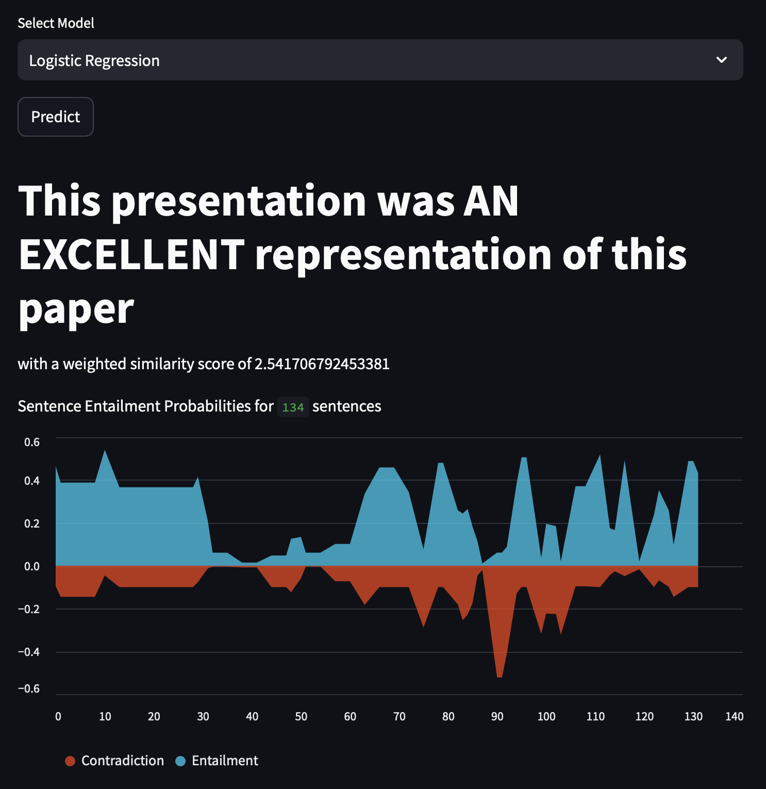

# Presentation Evaluation Using Machine Learning



## Overview

This repository contains the code and resources for the CS 4120 project by Joshua Segal and Cris Hernandez at Northeastern University. The project focuses on evaluating presentation-paper pairs for entailment, aiming to provide a robust rating system for presentations based on research papers. The method involves keyword matching presentation sentences to paper sentences and predicting entailment using machine learning models. The final rating is calculated using a weighted score.

## Report

[Access our project report here!](https://docs.google.com/document/d/1OfGY4GHFgta75f1Y15qswR-TceMsYTiG29EC4w4jIV4/edit?usp=sharing)

## Pipeline

### Datasets

- **Kaggle: Automatic Slide Generation from Scientific Papers**: This dataset comprises 5,000 presentation to paper pairs with XML mappings.
- **Kaggle: Stanford Natural Language Inference Corpus**: This dataset contains 570,000 manually labeled sentence pairs.

### Preprocessing

- Parsed XML files and cleaned/tokenized inputs.
- Word embeddings were created using Word2Vec, CountVectorizer, and DistilBERT tokenizer.
- Label data was transformed into one-hot vectors.

### Model Training/Tuning

- **LSTM RNN**: Implemented using Keras Functional API.
    - **Hyperparameters**:
        - Learning Rate: 0.001
        - LSTM Dropout: 0.27
        - Dense Dropout: 0.14
        - LSTM Units: 67
        - Dense Units: 89
    - **Performance**:
        - Precision: 0.624
        - Recall: 0.620
        - F1 Score: 0.6191
        - Accuracy: 0.600

- **DistilBERT Transformer**:
    - **Hyperparameters**:
        - Learning Rate: 0.001 (default)
        - Dense ReLU Units: 64
        - Dense Softmax Units: 3
    - **Performance**:
        - Precision: 0.601
        - Recall: 0.264
        - F1 Score: 0.365
        - Accuracy: 0.525

### Fine-Tuning

- Bayesian optimization was used to find optimal hyperparameters.
- Smaller steps per epoch were used with BERT to reduce training time.
- LSTM units and dense units were adjusted to balance model complexity and prevent overfitting.
- Learning rate scheduling was considered to improve performance, especially with large datasets.

## Comparison

- **Accuracy**:
    - LSTM RNN: 0.62
    - Transformer: 0.525
- **Loss**:
    - LSTM RNN: 0.8366
    - Transformer: 0.9507

## Demo

To access the demo, follow these steps:

1. Clone the repository to your local machine

2. Launch the Streamlit local app:

```
streamlit run frontend.py
```

3. Input paper and presentation XML files
4. Choose your model and inference results

## Future Directions

- **Human Feedback Integration**: Incorporate human feedback to enhance model performance and real-world relevance.
- **Entailment Pair Creation**: Explore more nuanced sentence matching techniques (e.g., Word2Vec) beyond keyword matching.
- **Sentence Grouping**: Dynamically group sentences by similarity to improve entailment matching.
- **Rating Summary**: Develop a system to suggest areas of improvement for presentations and highlight missed important topics or information.
